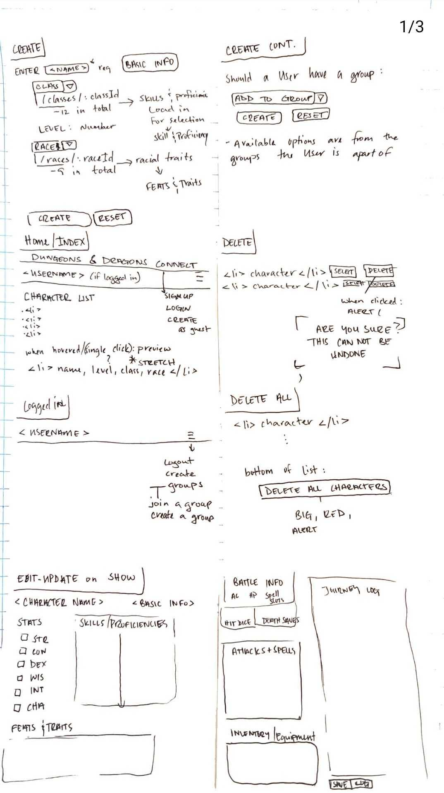
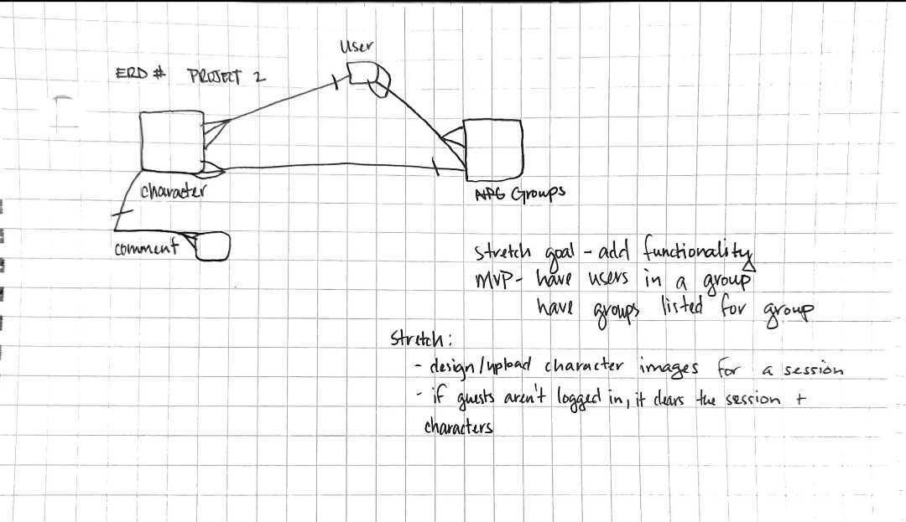

# project-2-DnDConnect

MVP: 

As a user ( I should be able to):

# FULL-CRUD
- create a character
    - new schema
    - create a model to use
    - return a newly created character
- view all characters
    - query all characters in collection - find()
    - return all characters
- view a single character
    - query for a single character - by ID
    - return single correct character
- update a single character
    - query for a single character - by ID
    - update that single character field
    - return updated character
- delete a single character
    - query for a single character - by ID
    - alert "Are you sure" // *stretch goal: enter a pin or user password to verify deletion*
    - delete or remove character
    - return a success of some kind
- delete multiple characters
    - query all characters in a collection - find()
    - alert "Are you sure" // *stretch goal: enter a pin or user password to verify deletion*
    - delete/remove the collection - method override
    - return success

# Functionality
Character:
- should be able to "kill" a character after failed death saves; NOT delete
    - query for a single character - by ID
    - create a boolean for alive/death
    - add a default value == true
    - return updated character information
- when creating a new character
    - create a drop down menu for class and race
        - assign class (12 choices) load-in to route into skills/proficiencies
            - create checkboxes for user selection of class attributes
            - boolean: default false, when checked, true 
            - assign saved selections to skills & proficiences
            - return success upon creation of character
        - create a dropdown menu for race (9 choices)
            - create checkbox for subrace (if available)(required)
            - default: false, true upon being checked
            - then show route racial traits
            - assign saved selections to features & traits
        *stretch goal: allow for homebrew & expansive race/classes*
        *stretch goal: add user groups during character creation to load in a character to that group*
User/Group:
- should be able to add users to a group
    - query by ._id
    - add/move user under the group collection
    - return a success

# Schemas: (model)
- User
    -username - string (required, unique)
    -password - string (required)
    -characters - [] // user can have many characters
    -groups - [] // user can have many groups
    timestamps: true

- Character
    - name - string (required)
    - class - string (required - how to multi-class *stretch goal*)
    - level - number (required)
    - race - string (required)
    - groups - // a character can't be in two games at one time at this time *stretch goal: character will duplicate when added to another group*
    - owner - Schema,Types.ObjectId ref: 'User'
    - alive: boolean; default true
    timestamps: true

- Group
    -name - string (required)
    -characters - [] // group can have many characters
    -groups - [] // group can have many users

# API reference

- https://www.dnd5eapi.co/

# Routes Table
|   NAME   |     PATH       |   HTTP VERB     |            PURPOSE                   |
|----------|----------------|-----------------|--------------------------------------| 
| Index    | /dndconnect    |      GET        | Displays all of the characters       |
| New      | /dndconnect/new|      GET        | Shows new form for a new character   |
| Create   | /dndconnect    |      POST       | Creates a new character              |
| Show     | /dndconnect/:id|      GET        | Shows one specified character        |
| Edit     | /dndconnect/:id/edit| GET        | Shows edit form for one character    |
| Update   | /dndconnect/:id|      PUT        | Updates a single character           |
| Destroy  | /dndconnect/:id|      DELETE     | Deletes a single character           |

# Wireframes & ERD

